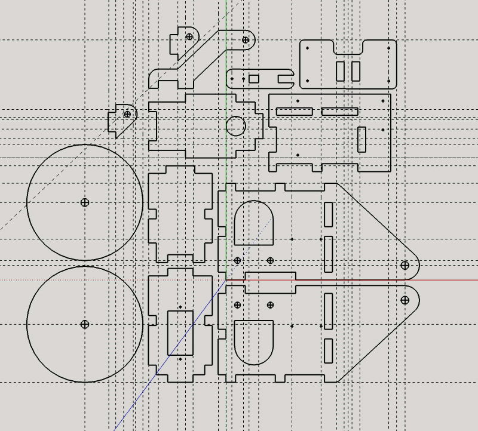
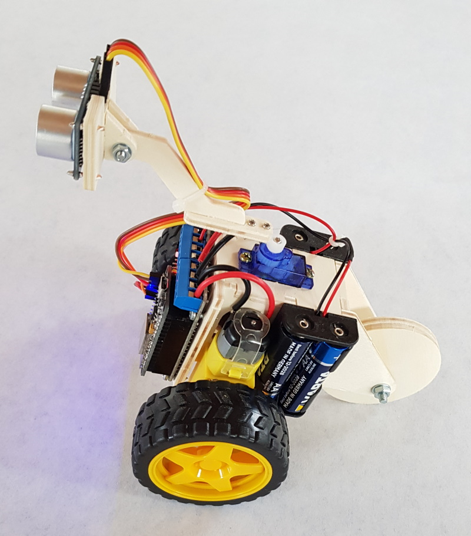
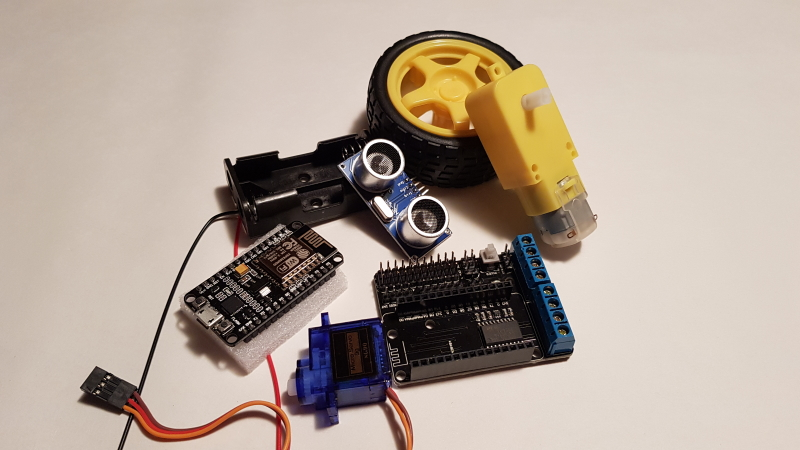
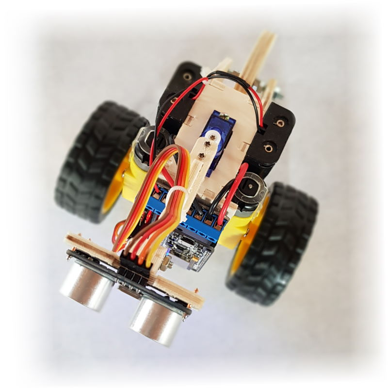

# Scru-FE-Education
ESP8266 controlled Scru-FE with routed parts   
Inspirations from : https://www.thingiverse.com/thing:780050

## Beschreibung
Dieses Projekt soll Jugendlichen ab 12 Jahren die Programmierung von Microcontrollern näher bringen. Das Projekt ist dafür 
ausgelegt, z.B. Aktionen als Ferienprogramm anzubieten. Die zeitliche Planung sollte zwei Tage beinhalten. Am ersten Tag wird 
der Roboter aus den gefrästen Teilen zusammengebaut, am zweiten Tag wird er dann programmiert. Weitere Informationen zu dem 
Projekt findet man unter http://www.kidbuild.de
 
## Verzeichnisstruktur
- pics = Bilder
- source = Arduino Sketch
- docs = Anleitung für die Montage des Roboters
- dxf = Fräsdaten für CNC Bearbeitung (4mm Pappel Sperrholz)

## Projektbilder
   
   
   
   

## Changelog

### 1.0
- (Eisbaeeer)
Initial Version

## License
The MIT License (MIT)
Copyright (c) 2019 Eisbaeeer <eisbaeeer@gmail.com> 
